# 📊 Detailed Analysis Report: Student Performance Predictors

This report provides a comprehensive analysis of the student performance dataset, examining demographic, parental, social, and academic factors that influence final grades (`G3`). It outlines exploratory findings and details the predictive performance of the trained machine learning models.

---

## 1. Executive Summary
Predicting student performance is crucial for early intervention programs in educational institutions. This study analyzes 395 students across various demographics and social indicators. 
* **Key Finding**: A student's current academic trajectory (represented by mid-term grade `G2`) and attendance rate (`absences`) are the most powerful predictors of final grades.
* **Top Model**: A **Random Forest Regressor** predicts final grades with an **$R^2$ score of 0.8300** and a **Mean Absolute Error (MAE) of 1.1051** on a 20-point scale, substantially outperforming a standard Linear Regression model.

---

## 2. Exploratory Data Analysis & Feature Insights

### 2.1 Student Demographic Profile
* **School Imbalance**: The dataset consists of students from two schools: Gabriel Pereira (`GP`) and Mousinho da Silveira (`MS`). The population is heavily skewed towards GP, meaning the model is optimized for GP's environment.
* **Age & Address**: Student ages range from 15 to 22, with the majority between 15 and 18. Most students reside in urban areas (`U`), which typically correlates with shorter travel times and higher internet availability compared to rural (`R`) students.

### 2.2 Parent & Family Influences
* **Parental Jobs (`Mjob`, `Fjob`)**: Mother's and father's jobs show a strong presence of civil services and general/unclassified jobs (`other`). Parents working as teachers or in healthcare are less frequent but show a positive correlation with higher education expectations.
* **Family Stability (`famrel`, `Pstatus`)**: Family relationship quality is generally rated high (mean of 3.94 out of 5). Stable family conditions correlate with lower student anxiety and steadier grade trends.

### 2.3 Study Habits & Academic Support
* **Study Time**: Weekly study times are categorized into bands:
  * Low study time (<2 hours/week) is associated with higher failure rates.
  * Optimal study time (5-10 hours/week) shows the strongest balance of high grades without diminishing returns.
* **Past Failures**: The number of past class failures has a severe negative impact on a student's confidence and final grade. It shows a strong negative correlation with `G3`.
* **Paid Classes (`paid`) & Support (`schoolsup`)**: Interestingly, students receiving extra school support (`schoolsup = yes`) often have lower initial grades (`G1`), indicating that these support programs are correctly targeting struggling students.

### 2.4 Social Habits & Absences
* **Alcohol Consumption (`Dalc`, `Walc`)**: Workday alcohol consumption is generally low (mean 1.48/5), but weekend consumption rises significantly (mean 2.29/5). High alcohol consumption levels correlate with higher school absences and lower average grades.
* **Absences**: The distribution of school absences is highly skewed. While the median is 4 absences, some students have up to 75 absences. The analysis confirms a strong downward pressure on grades as absences exceed 10.

---

## 3. Grade Trajectory Correlation
The grades are recorded across three periods: `G1` (first period), `G2` (second period), and `G3` (final grade).

* **Multi-collinearity**: There is a high positive correlation between `G1` and `G2` (~0.85) and between `G2` and `G3` (~0.90).
* **Exam Performance Drop**: A significant sub-population of students scored exactly `0` in `G3` despite having non-zero `G1` and `G2` scores. This indicates students who either missed the final exam or dropped out of the course, creating a bimodal final grade distribution.

---

## 4. Machine Learning Modeling Results

Two models were trained to predict final grades (`G3`) using all demographic, social, and previous grade features.

### 4.1 Evaluation Comparison

| Evaluation Metric | Linear Regression | Random Forest Regressor |
| :--- | :---: | :---: |
| **$R^2$ Score (Variance Explained)** | `0.7546` | **`0.8300`** |
| **Mean Absolute Error (MAE)** | `1.4955` | **`1.1051`** |

* **Linear Regression Performance**: Linear Regression achieves a respectable $R^2$ score of 0.7546, suggesting linear dependencies are strong (due to the linear correlation of `G2` with `G3`).
* **Random Forest Advantage**: The Random Forest Regressor improves the prediction accuracy to an $R^2$ of 0.8300. It successfully models non-linear interactions, such as the combined effect of high absences and failures on final grade drops.

### 4.2 Feature Importance Mapping
The Random Forest model calculates feature importance based on mean decrease in impurity:

```mermaid
gantt
    title Feature Importance (%)
    dateFormat  X
    axisFormat %s
    
    section Predictors
    G2 (Second Period Grade)    :active, 0, 79
    absences (School Absences)  :active, 0, 11
    age (Student Age)           :active, 0, 2
    reason (School Reason)      :active, 0, 1
    G1 (First Period Grade)     :active, 0, 1
```

* **G2 Dominance (79.25%)**: Because G2 represents the student's status right before the final period, it naturally captures most of the variance.
* **Absences (11.03%)**: This highlights attendance as the second most vital indicator of final performance, ahead of parental background and demographic parameters.

---

## 5. Actionable Recommendations for Educators
Based on the data analysis and feature importances, the following interventions are recommended:

1. **Early Attendance Warnings**: Since `absences` is the leading non-academic predictor of grade decline, schools should flag students as soon as they exceed 5 absences in a term.
2. **Prioritize Mid-term Intervention**: `G2` is highly predictive of `G3`. Students showing a declining trend or scoring below 10 in `G2` should be immediately paired with peer tutors or academic counseling.
3. **Monitor Past Failure History**: Students entering a course with a history of `failures` are at high risk. Diagnostic tests at the start of the year can help tailor support before `G1` grades are finalized.
